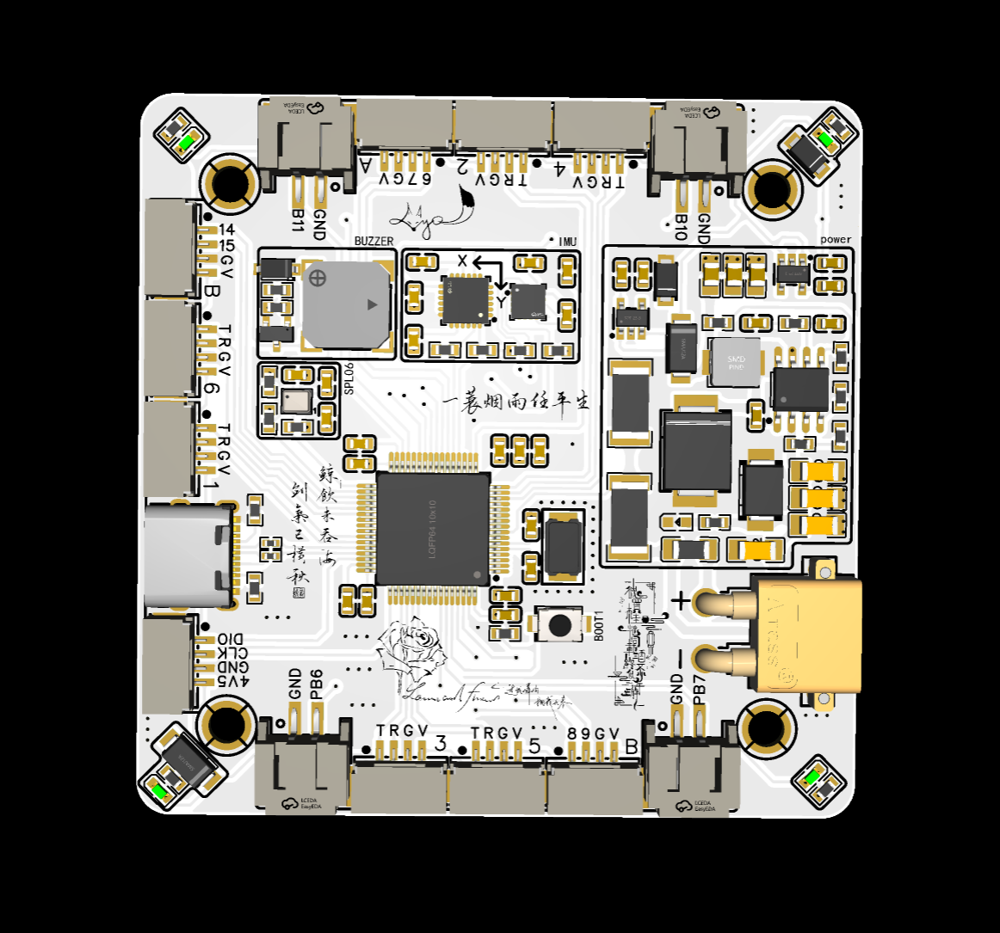
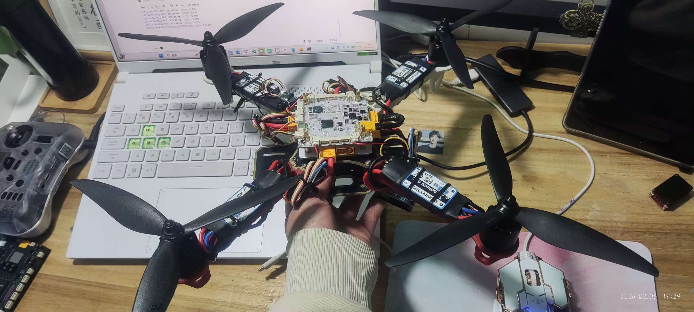

# 胤天飞控 (YINTIAN Flight Controller)

## 硬件配置

| 组件 | 型号 |
|------|------|
| 主控芯片 | STM32F405RGT6 |
| 机架 | F330 |
| 电机 | 朗宇 X2212 kv1250 |
| 螺旋桨 | 8040 |
| 陀螺仪 | WT901C |
| 光流模块 | T1-001plus |
| 遥控接收机 | ELRS |

## 功能特性

- 姿态稳定模式
- 光流定点
- 定高飞行
- 基础遥控起飞/降落

> ⚠️ **注意**：当前版本仅支持基础遥控起飞逻辑，尚未包含一键起飞/降落、自动返航等高级功能。这些功能将在后续更新中添加。

## 项目结构

```
YT-FC/
├── YT-FC-F405-V1.0/          # 飞控固件源码
│   ├── Core/                   # STM32CubeMX生成代码
│   ├── MDK-ARM/                # Keil工程文件
│   │   ├── FCDrive/            # 外设驱动
│   │   │   ├── WT901C.c/h      # 陀螺仪驱动
│   │   │   ├── T1Plus.c/h      # 光流驱动
│   │   │   ├── ELRS.c/h        # 遥控接收机驱动
│   │   │   ├── Buzzer.c/h      # 蜂鸣器驱动
│   │   │   └── VOFA.c/h        # VOFA调参驱动
│   │   ├── FCSrc/              # 飞行控制核心
│   │   │   ├── pid_control.c/h # PID控制算法
│   │   │   ├── imu.c/h         # 姿态解算
│   │   │   ├── Scheduler.c/h   # 任务调度
│   │   │   └── ...
│   │   └── FCPower/            # 动力控制
│   └── FCF405.ioc              # CubeMX工程配置
├── Module-materials/           # 配件资料
├── picture/                    # 实物图片
└── README.md
```

## 开发工具

- **IDE**: Keil MDK-ARM
- **配置工具**: STM32CubeMX
- **调参小程序**: lsl-sys (支持蓝牙串口调参，兼容VOFA+协议)
- **调参软件**: VOFA+ 

## 微信小程序调参

配合PCB中DAP-ESP32S3微信蓝牙调参小程序 **"lsl-sys"**  或  **"VoFA+"** 软件可实现无线调参功能，该小程序支持VOFA+协议，可实时调整PID参数。(透传代码参考https://github.com/lsl-sys/ESP32S3-DevBoard 或嘉立创广场搜索DAP)

## 实物展示

| 飞控PCB 3D图 | 实物图 |
|:---:|:---:|
|  |  |

## 开源协议

本项目基于 **MIT License** 开源，欢迎学习和交流。

---

**作者**: lsl-sys  
**GitHub**: [https://github.com/lsl-sys](https://github.com/lsl-sys)

> 胤天:承天之势，御风而行。(初次踏足飞行器领域,仍在学习中,欢迎交流)
> 飞行有风险，请确保安全操作。